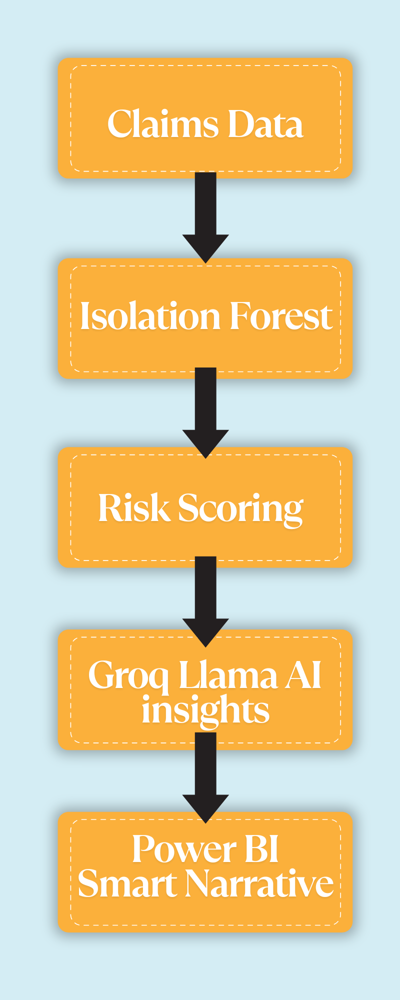
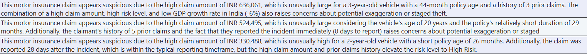
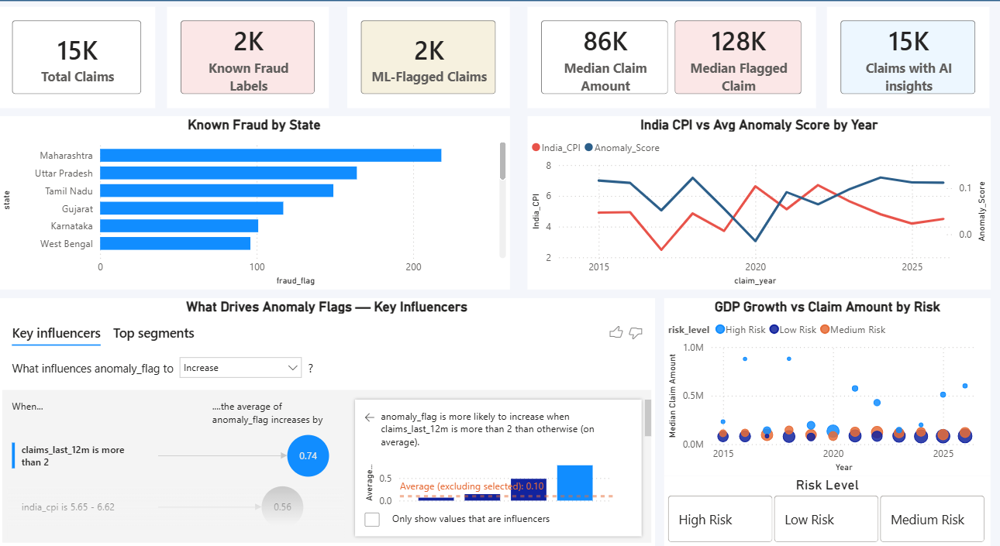

::: {layout-ncol=2 .custom-metadata-grid}

::: {.justify-left}

Author:

[Chethana M S](https://www.linkedin.com/in/mschethana/)

:::

::: {.text-end}

Published

June 18, 2026

:::

:::

## Introduction

Traditional dashboards excel at answering *what happened*.

But for fraud investigators, the high-stakes question is always:

> Why did this happen, and where should I look next?

This project bridges that gap - By combining Power BI with an Isolation Forest anomaly detection model, Groq's Llama API, and native analytics like Key Influencers, this dashboard moves beyond basic reporting into automated, AI-powered explanation.

::: {.stats-corner}
Anomaly detection rests on a simple statistical idea: fraud is rare, and rare events are easier to **isolate** than to **classify**. Rather than learning what fraud looks like (a supervised approach that needs labeled examples), an anomaly detector learns what "normal" looks like and flags whatever falls outside — the same logic behind control charts and z-score outlier tests in classical statistical process control.
:::

## Solution Architecture

{width=30% fig-align="center"}

The pipeline runs in four stages: synthetic claims data is generated in Python, scored by an Isolation Forest model, loaded into Power BI alongside the raw features, and then explained — first by Power BI's native Key Influencers visual, and second by a Groq-hosted Llama model that turns the numeric evidence into an investigator-readable narrative.

::: {.stats-corner}
The architecture treats the model's **contamination rate** — the assumed proportion of fraudulent claims in the population — as a tunable prior, not a fixed constant. Set it too high and investigators drown in false leads; set it too low and fraud hides comfortably inside the bulk of "normal" claims. Choosing this value is a precision/recall trade-off dressed up as a single parameter.
:::

---

## Creating Synthetic Claims Data

Since real claims data is sensitive and rarely shareable, this project starts with a synthetic dataset built to mimic the shape of real insurance claims using parameters calibrated to:IRDAI Annual Report 2023-24 (fraud prevalence ~9%, vehicle type mix,claims ratio 82.52%, surveyor threshold ₹75,000) and IMF WEO April 2026 — India CPI & GDP growth (actual + projections) data. It has right-skewed claim amounts, a long tail of late-reported claims, and a small minority of fraud-correlated patterns rather than purely random noise.

::: {.stats-corner}
Isolation Forest works like a randomized game of twenty questions. Each tree splits the data on random features at random thresholds, and outliers — sitting far from the crowd — tend to get separated from everyone else in far fewer splits than normal points do. Average that "path length" across the forest, and a short average path becomes the statistical signature of an anomaly.
:::

---

## Gen AI Insights using Groq API

A numeric anomaly score tells an investigator *that* something is unusual, not *why*. To close that gap, the top 20 flagged claim's score and feature values are passed to a Llama model hosted on Groq, which returns a short, plain-English explanation grounded in the actual numbers rather than a free-form guess.

::: {.stats-corner}
`temperature=0.3` is a statistical choice, not a stylistic one — it narrows the model's output distribution so the same claim produces a consistent explanation run to run, much like reducing variance in a noisy estimator. Just as important: the prompt hands the model the actual feature values and score instead of asking it to infer them, grounding the generated text in evidence rather than letting it hallucinate a plausible-sounding story.
:::

---

## Dashboard Design

Key KPI cards summarize claim volumes, known fraud cases, machine-learning flagged claims, and median claim amounts. Visualizations highlight the geographic distribution of fraud, yearly trends between inflation (CPI) and anomaly scores, and the relationship between GDP growth, claim amounts, and risk categories. A built-in Key Influencers analysis explains the factors driving anomaly flags, revealing that customers with more than two claims in the previous 12 months are significantly more likely to be classified as suspicious. Together, the dashboard enables insurers to monitor fraud patterns, understand risk drivers, and support data-driven investigation decisions.

::: {.stats-corner}
Power BI's Key Influencers visual isn't magic — under the hood it runs a sequence of statistical tests (chi-square for categorical splits, a step-wise logistic regression for continuous ones) to measure each candidate field's marginal association with the target, then ranks fields by effect size. It's a lightweight, point-and-click cousin of the feature-importance techniques used to interpret the Isolation Forest itself.
:::

---

## Smart Narrative vs Generative AI

Power BI ships with a built-in Smart Narrative visual, and it's worth being precise about how that differs from the Groq-powered explanations above — they look similar on the surface but work in fundamentally different ways.

| | Smart Narrative (Power BI native) | Gen AI Insight (Groq + Llama) |
|---|---|---|
| **How it works** | Fills pre-built phrase templates with computed aggregates | Reasons freely over the supplied numbers in natural language |
| **Flexibility** | Fixed sentence structures, limited vocabulary | Open-ended phrasing, can adapt tone and emphasis |
| **Grounding** | Always numerically exact (it's just string interpolation) | Numerically grounded only if the prompt supplies the values |
| **Best for** | Fast, reliable summary stats on any page | Investigator-style reasoning about *why* a specific claim looks risky |

::: {.stats-corner}
Strip away the branding and the line between the two is really "rule-based string interpolation over computed statistics" versus "a language model conditioned on those same statistics." Same underlying numbers, different layer of abstraction on top.
:::

---

## Sample AI Explanation

Here's one flagged claim end to end — the model's verdict, followed by the generated explanation an investigator would actually read.

**Claim:** \ Rs 1112308.25 · vehicle age is 20 years · 13-month-old policy · submitted in 2020 with a GDP growth rate of -6%
**Anomaly score:** -0.14 (High)

> *The motor insurance claim appears suspicious due to the unusually high claim amount of INR 1,112,308 for a 13-month-old policy with no prior claims, suggesting potential exaggeration or fabrication. Additionally, the vehicle's 20-year age and the current economic downturn in India (negative GDP growth of -6%) may indicate that the claimant is taking advantage of the financial strain to inflate*

---

## Key Learnings

- Unsupervised models live or die by the **contamination** assumption — it deserves as much tuning attention as any supervised hyperparameter.
- An LLM explanation is only as trustworthy as the numbers it's grounded in; ungrounded prompts invite confident-sounding hallucination.
- Power BI's native Key Influencers is a strong complement to a custom model, not a replacement — it's fast to read but shallower than a purpose-built detector.
- Synthetic data design matters more than expected: correlated, skewed features make for a far more convincing demo than uniform random noise.

::: {.stats-corner}
The single biggest lesson was really about precision and recall in disguise: every contamination value tested traded false leads for missed fraud somewhere on that curve, and no single number was "correct" — only better or worse suited to how much investigator time the team actually had.
:::

---

## Future Improvements

- Replace synthetic labels with real (or real-adjacent) outcomes and benchmark against a supervised ensemble.
- Build a feedback loop so investigator dispositions (confirmed fraud / false positive) retrain the model over time.
- Calibrate raw anomaly scores into true probabilities, since Isolation Forest scores are a ranking, not a probability, out of the box.
- Extend the Groq prompt with case history and prior similar claims for richer context.
- Add SHAP-based explainability alongside Key Influencers for a second, model-native view of "why."

::: {.stats-corner}
That calibration point is worth dwelling on: an Isolation Forest score tells you claim A is *more* anomalous than claim B, but not that claim A has a "73% chance of being fraud." Getting from a ranking to a calibrated probability needs an extra step — typically Platt scaling or isotonic regression fit against some ground truth.
:::
