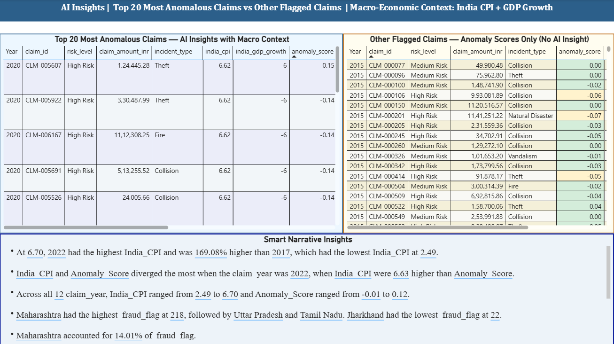

::: {layout-ncol=2 .custom-metadata-grid}

::: {.justify-left}

Author:

[Chethana M S](https://www.linkedin.com/in/mschethana/)

:::

::: {.text-end}

Published

July 1, 2026

:::

:::

## Introduction

Traditional dashboards excel at answering *what happened*.

But for fraud investigators, the high-stakes question is always:

> Why did this happen, and where should I look next?

This project bridges that gap by combining machine learning, generative AI, and business intelligence to create an explainable anomaly detection solution. An Isolation Forest model identifies potentially fraudulent or unusual insurance claims, Groq's Llama API provides contextual explanations for each anomaly, and Power BI delivers interactive analytics through dashboards, Key Influencers, and Smart Narratives. Rather than simply detecting anomalies, the solution focuses on making AI-driven insights interpretable and actionable for business users.

::: {.stats-corner}
Anomaly detection rests on a simple statistical idea: fraud is rare, and rare events tend to stand out from normal patterns. In statistics, we often hear the term “outliers” – any observation that falls unusually far from the rest of the data points is considered an outlier. Traditional statistical techniques for identifying outliers include Z-scores and IQR (Interquartile Range). But in the real world, multiple features are often interdependent. Individually, each feature may appear perfectly normal, but when considered together, their combined effect may deviate significantly from expected patterns. This is where anomaly detection comes into play. An anomaly can be thought of as a multidimensional extension of the traditional concept of an outlier -- Instead of examining a single variable, anomaly detection evaluates patterns across multiple variables and identifies observations that deviate from normal behavior.
:::

## Solution Architecture

{width=30% fig-align="center"}

The pipeline runs in five stages: synthetic claims data is generated in Python, anomalies are detected using an Isolation Forest model, risk scores/ labels are assigned based on the anomaly score distribution, the AI Insights are generated using Groq Llama API for the top 20 most anomalous claims and the results are loaded into Power BI alongside the raw features. Thus the results are explained in two ways — first through the Groq-hosted Llama model and second through Power BI's native Key Influencers & smart narratives visual that transforms the numeric evidence into an investigator-readable narrative.

::: {.stats-corner}
The architecture treats the model's **contamination rate** — the assumed proportion of fraudulent claims in the population — as a tunable prior, not a fixed constant. Set it too high and investigators drown in false leads; set it too low and fraud hides comfortably inside the bulk of "normal" claims. Choosing this value is a precision/recall trade-off dressed up as a single parameter.
:::

---

## Creating Synthetic Claims Data

Since real claims data is sensitive and rarely shareable, this project starts with a synthetic dataset built to mimic the shape of real insurance claims using parameters calibrated to : IRDAI Annual Report 2023-24 (fraud prevalence ~9%, vehicle type mix, claims ratio 82.52%, surveyor threshold ₹75,000) and IMF WEO April 2026 — India CPI & GDP growth (actual + projections) data. It has right-skewed claim amounts, a long tail of late-reported claims, and a small minority of fraud-correlated patterns rather than purely random noise.

---

## Isolation Forest for Anomaly Detection

Isolation Forest is an unsupervised machine learning algorithm designed to identify anomalies by exploiting the fact that unusual observations are easier to isolate than normal ones. Rather than modeling normal behavior or estimating underlying data distributions, it works like a randomized game of 20 Questions, repeatedly partitioning the data using randomly selected features and split values to build a collection of isolation trees. Since anomalous observations lie in sparse regions of the feature space, they are typically isolated after fewer splits than normal observations, resulting in shorter average path lengths across the forest. This distribution-free approach makes Isolation Forest particularly effective for high-dimensional, skewed, and complex real-world datasets where traditional statistical outlier detection methods may struggle. In this project, the model assigns an anomaly score to each insurance claim, with the highest-scoring claims flagged as potential anomalies for further investigation. These scores then form the basis for both the AI-generated explanations and the interactive Power BI visualizations, enabling suspicious claims to be identified and interpreted in a clear, business-friendly manner.

::: {.stats-corner}
An Isolation Forest score tells you claim A is *more* anomalous than claim B, but not that claim A has a "73% chance of being fraud." Getting from a ranking to a calibrated probability needs an extra step — typically Platt scaling or isotonic regression fit against some ground truth.
:::

::: {.stats-corner}
Some classical statistical techniques for anomay detection are:

* __Z-scores__: Measures how many standard deviations a data point is from the mean. A high absolute Z-score indicates an outlier.
* __Box-plots / IQR (Interquartile Range)__: Measures the spread of the middle 50% of the data - Points outside 1.5 times the IQR from the first and third quartiles are considered outliers.
* __Mahalanobis distance__: Measures the distance of a point from the mean of a multivariate distribution, taking into account correlations between variables. Points with high Mahalanobis distances are considered outliers. -- It acts as a Multivariate equivalent of Z-scores.

Some classical machine learning techniques for anomaly detection are:

- Unsupervised Models:

* __DBSCAN__: It groups densely packed data points together into clusters. Points that do not belong to any cluster are considered outliers.
* __One-Class SVM__: It learns and establishes a decision boundary around the normal data points, and points outside this boundary are considered outliers.
* __Local Outlier Factor (LOF)__: It measures the local density deviation of a data point with respect to its neighbors. Points with significantly lower density than their neighbors are considered outliers.

- Semi-Supervised Models:

* __Autoencoders__: Neural networks that learn to compress and reconstruct data. Points with high reconstruction error are considered outliers:
* __LSTM-based models__: For sequential data, LSTM networks can learn normal patterns and flag deviations as anomalies.

:::

---

## Gen AI Insights using Groq API

A numeric anomaly score tells an investigator *that* something is unusual, not *why*. To close that gap, the top 20 flagged claim's score and feature values are passed to a Llama model hosted on Groq, which returns a short, plain-English explanation grounded in the actual numbers rather than a free-form guess.

::: {.stats-corner}
Here, `temperature=0.3` is a statistical choice, not a stylistic one — it narrows the model's output distribution so the same claim produces a consistent explanation run to run, much like reducing variance in a noisy estimator. Just as important: the prompt hands the model the actual feature values and score instead of asking it to infer them, grounding the generated text in evidence rather than letting it hallucinate a plausible-sounding story.
:::

---

## Dashboard Design

Key KPI cards summarize claim volumes, known fraud cases, machine-learning flagged claims, and median claim amounts. Visualizations highlight the geographic distribution of fraud, yearly trends between inflation (CPI) and anomaly scores, and the relationship between GDP growth, claim amounts, and risk categories. A built-in Key Influencers analysis explains the factors driving anomaly flags, revealing that customers with more than two claims in the previous 12 months are significantly more likely to be classified as suspicious. In the AI Insights page, the dashboard provides detailed explanations for each flagged claim, helping investigators understand the reasoning behind why a particular claim is marked as fraudulent. A portfolio level summary is also provided by the Power BI's built-in Smart Narrative visual. Together, the dashboard enables insurers to monitor fraud patterns, understand risk drivers, and support data-driven investigation decisions.

::: {.stats-corner}
Power BI's Key Influencers visual isn't magic — under the hood it runs a sequence of statistical tests (chi-square for categorical splits, a step-wise logistic regression for continuous ones) to measure each candidate field's marginal association with the target, then ranks fields by effect size. It's a lightweight, point-and-click cousin of the feature-importance techniques used to interpret the Isolation Forest itself.
:::

::: {.stats-corner}
One more point to note here is - Whenever we have a dataset with high valued outliers, the median is a better measure of central tendency than the mean. *The median is less sensitive to extreme values* and provides a more robust representation of the typical value in the dataset. In this case, using the median claim amount helps to avoid skewing the analysis due to a few exceptionally high claims, allowing for a more accurate assessment of the overall claim distribution.
:::
---

## Smart Narrative vs Generative AI

Power BI includes a built-in Smart Narrative visual that automatically summarizes report data. While it may appear similar to the LLM-generated explanations used in this project, the two approaches serve different purposes. Smart Narratives focus on describing what the data shows, whereas the LLM generates contextual explanations for why a specific claim has been identified as anomalous.

| | Smart Narrative (Power BI native) | Gen AI Insight (Groq + Llama) |
|---|---|---|
| **How it works** | Automatically generates summaries from report measures and visuals using built-in analytics | Generates contextual explanations from the supplied claim attributes and anomaly score in natural language |
| **Flexibility** | Fixed sentence structures, limited vocabulary | Open-ended phrasing, can adapt tone and emphasis |
| **Grounding** | Always numerically exact (it's just string interpolation) | Depends on the supplied prompt and data |
| **Explainability** | Describes *what* the data shows | Investigator-style reasoning about *why* a specific claim looks risky |

::: {.under-the-hood}
At their core, both Smart Narratives and LLM-generated explanations are driven by the same underlying statistics—they operate on the same measures, aggregates, and anomaly scores. The key difference lies in the abstraction layer. Smart Narratives apply predefined rules to transform those statistics into descriptive text, whereas an LLM generates context-aware explanations conditioned on the supplied numerical information and prompt. In other words, the data remains the same; only the mechanism used to translate it into natural language changes.
:::

---

## Sample AI Explanation

Here's one flagged claim end to end — the model's verdict, followed by the generated explanation an investigator would actually read.

**Claim:** \ Rs 1112308.25 · vehicle age is 20 years · 13-month-old policy · submitted in 2020 with a GDP growth rate of -6%
**Anomaly score:** -0.14 (High)

> *The motor insurance claim appears suspicious due to the unusually high claim amount of INR 1,112,308 for a 13-month-old policy with no prior claims, suggesting potential exaggeration or fabrication. Additionally, the vehicle's 20-year age and the current economic downturn in India (negative GDP growth of -6%) may indicate that the claimant is taking advantage of the financial strain to inflate*

---

## Key Learnings

- **Unsupervised anomaly detection is highly sensitive to the contamination parameter** - Choosing an appropriate value has a significant impact on model performance and should be treated as a critical hyperparameter rather than relying solely on the default setting.
- **LLM-generated explanations are only as trustworthy as the data they are grounded in** - Supplying the model with accurate numerical inputs and clear prompts is essential to minimize hallucinations and ensure faithful explanations.
- **Power BI's Key Influencers complements, rather than replaces, a dedicated anomaly detection model** - It excels at identifying factors associated with outcomes in the current dataset but is not designed to detect rare observations in the same way as an Isolation Forest.
- **Synthetic data quality is just as important as model selection** - Designing realistic distributions, feature correlations, and class imbalance produces demonstrations that better reflect real-world anomaly detection challenges.

::: {.stats-corner}
Perhaps, the biggest lesson was that contamination tuning is really about managing the precision-recall trade-off. Every value tested shifted the balance between generating more false leads and missing potentially fraudulent claims. There was no single "correct" contamination value — only one that best matched the available investigator capacity and the business's tolerance for risk.
:::

---

## Future Improvements

While the current solution demonstrates an end-to-end anomaly detection workflow, there are several directions that could make it even more robust:

- **Benchmark against supervised models**. Compare Isolation Forest with supervised ensemble methods using real or realistically labeled fraud outcomes to understand where each approach performs best.
- **Introduce a feedback loop** - Use investigator outcomes (confirmed fraud vs. false positive) to periodically retrain or refine the model as fraud patterns evolve.
- **Enhance model explainability** - Complement Power BI's Key Influencers with SHAP values to provide model-specific explanations for why individual claims are flagged.
**Improve AI-generated explanations** - Enrich the LLM prompt with historical case summaries and similar claims to generate more contextual and actionable insights.

---
